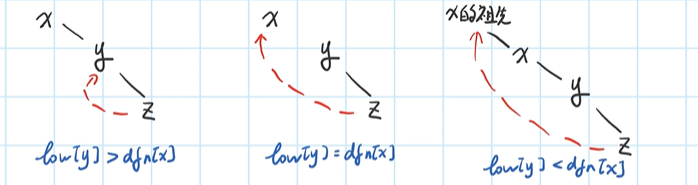

# Tarjan 求割点

## 割点与桥的定义

在一个无向联通图中，如果删除**某个点和与其相连的边**，图会不联通，那么这个点就称之为割点。

在一个无向联通图中，如果删除**某条边**，图会不联通，那么这条边就称之为桥。


例如在这张图中，割点有 $3,4,7$，桥有 $3-4,4-7,5-7,4-6$

## Tarjan 算法核心思想

### 数据结构

+ dfn[x]:在 DFS 中，x 实际被访问的时间点。

+ low[x]:在 DFS 中，x 通过无向边可回溯到的最早时间点。

### DFS 过程

#### 割点部分

当前搜到的点为 x，考虑在哪些情况下，x 是割点。

1. x 是非根节点，且存在至少一个子节点，并且能够保证 `low[x的子节点]>=dfn[x]`。

当 x 为割点时，需要保证 x 的子节点不能通过 x 以外的方式回溯到 x 的祖先节点，否则 x 就不是割点。

考虑 x 不是割点的情况，即 `low[x的子节点]>dfn[x]`，此时，x 的子节点能够回到 x 的祖先节点，那么 x 就不是割点。


可以用伪代码表示为：
```cpp
low[x的子节点]>=dfn[x]
```


2. x 是根节点，但是有至少两个子节点。

此时需要保证子节点之间并不相连，需要注意 DFS 顺序。

#### 桥部分

考虑在何种情况下, $x \to y$ 为桥。



当 $x \to y$ 为桥时，需要保证 y 的子节点不能回溯到 x 或 x 的祖先节点，否则 $x \to y$ 就不是桥。可以用伪代码表示为：

```cpp
low[y]>dfn[x]
```

关于为什么是 low[y] 而不是 low[y的子节点]:

> y 可能会因为自身的其他边回溯到x，也可能会因为他的子孙的边回溯到 x，这两种都会影响 low[y]，我们需要这两种情况下 y 均不能回溯到 x ，而这个等式是刚好能够包括这两种情况的，因此为low[y]。

