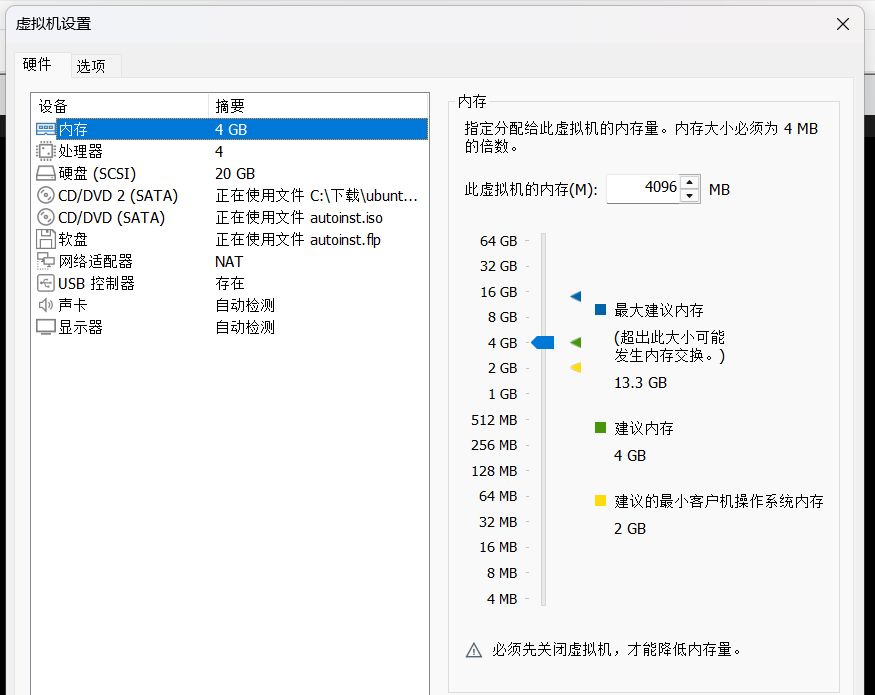
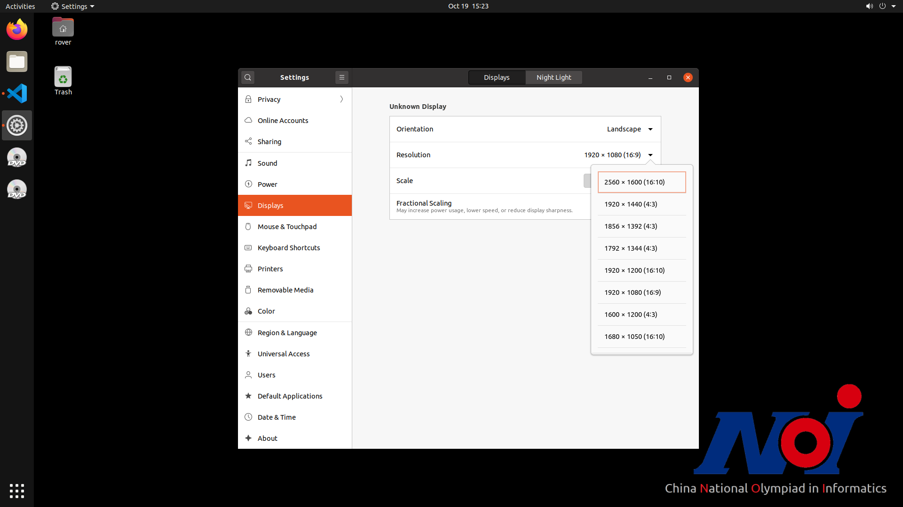
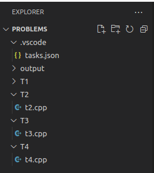
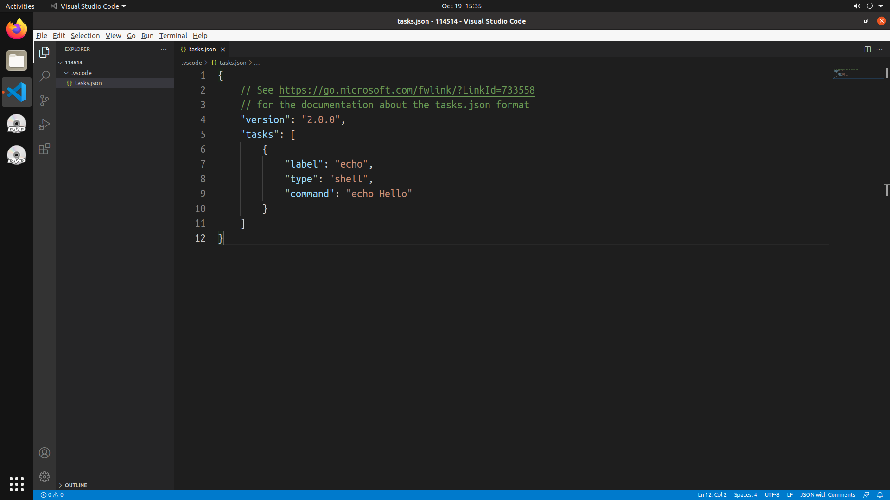
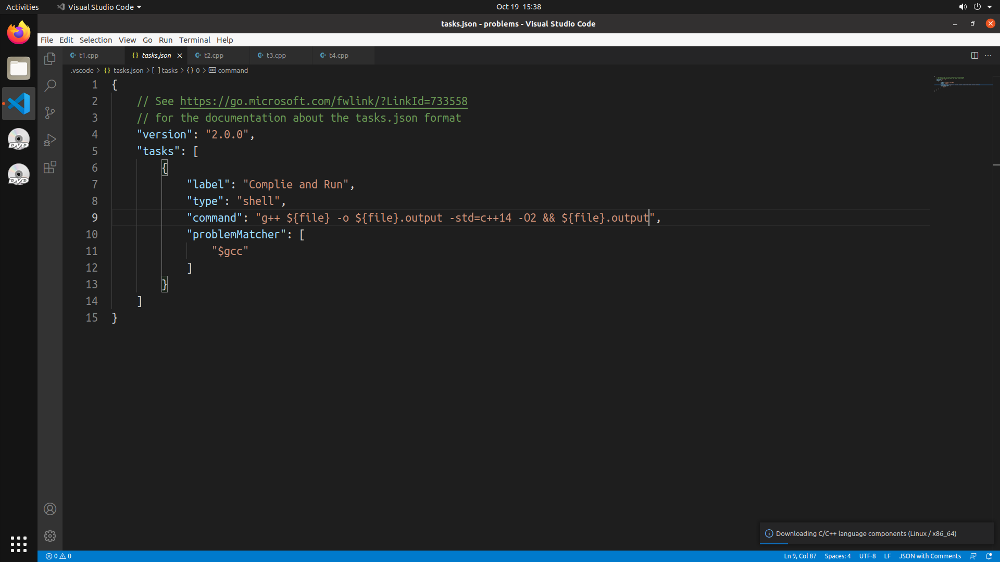
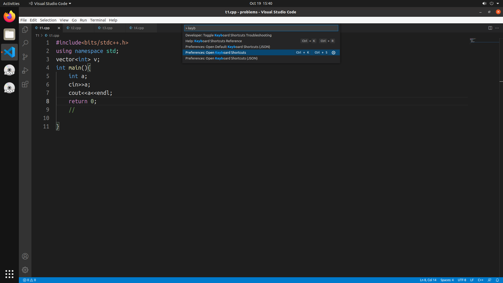
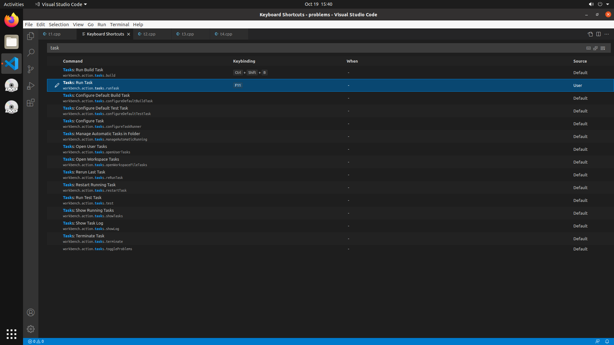
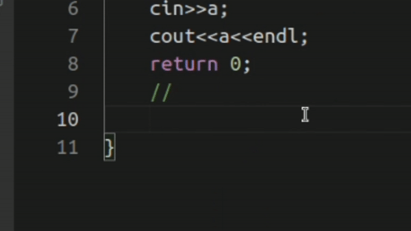

# 安装 Noi Linux

[官网](https://www.noi.cn/gynoi/jsgz/2021-07-16/732450.shtml)，我使用 VMware Workstation Pro 作为虚拟机平台。

下面是一些安装时的注意事项：

+ 安装虚拟机时，不要连接网络。在自定义硬件中，将网络适配器设置中的"启动时连接"取消勾选即可。

+ 建议在磁盘设置中选择"将虚拟磁盘储存为单个文件"以提高性能。

+ 建议在 CPU 处开启"虚拟化 Intel VT-x/EPT 或 AMD-V/RVI"选项以提高性能。

我使用以下配置在 i5-1240P 上可以流畅运行。



# 对系统的配置

## 调整分辨率（非必须）

沟槽的 Noi Linux 的分辨率没有 1920x1080，需要自己开。操作如下：

1. 打开终端，新建分辨率配置：

```bash
xrandr --newmode "1920x1080_60.00" 173.00 1920 2048 2248 2576 1080 1083 1088 1120 -hsync +vsync
```

这个东西可以通过 `xrandr` 命令查看，照抄便是，不用管。

2. 添加分辨率：

```bash
xrandr --addmode Virtual1 "1920x1080_60.00"
```

其中，`Virtual1` 是虚拟机的显示器名称。

3. 设置分辨率：

在设置中已出现分辨率选项，选择即可。



## 建立存放代码的文件夹结构

不建议在 Desktop 中存放代码，建议在 `home` 下新建一个文件夹，例如 `problem`，然后在其中新建文件夹存放代码。其中 `.vscode` 文件夹是 VSCode的配置文件存放的地方，下文会提到。为了更好的管理编译出来的文件，我这里用了一个 output 文件夹存放可执行文件。大致结构如图：



## 配置 VSCode 的编译与运行

我使用了 Task 来完成这个任务，自己配上快捷键后还是很好用的。

1. 打开 VSCode。Terminal -> Configure Default Build Task，选择 "Create tasks.json file from template"，选择 "Others"。



其中 lable 为名字，我们改为 "Complie and Run"。type 为 task 类型，"shell" 表示这个任务是要运行一段命令。 command 就是你要运行的命令了，我们把编译和运行的命令写在里面。



写出来就是这样。`${file}` 是 VSCode 的变量，表示当前打开的文件名，`${fileDirname}` 是当前打开的文件所在的文件夹，`${fileBasenameNoExtension}` 是当前打开的文件名（不含后缀）。

感觉还是很好理解的，这样我们就配置完成了。

2. 配置快捷键

打开键盘快捷方式，搜索 "task"，选择 "Run Task"，将快捷键改为你想要的按键，例如 F11。





3. 杂项配置

+ 配置字体：打开设置，搜索 "font"，可以更改 `Editor: Font Family`，但是 Noi Linux 的字库比较拉，没啥可以选的。~~（不能用 JetBrains Monos差评）~~

+ 自动保存：打开设置，搜索 "save"，将 `Files: Auto Save` 改为 `after Delay`。这样就可以在更改后自动保存。

+ 光标动画：打开设置，搜索 "cursor"，将 `Editor: Cursor Style` 改为 `smooth`，这样光标就会淡出淡入了。

+ 插入动画：打开设置，搜索 "anima"，将 `Editor: Cursor Smooth Caret Animation` 改为 `On`，这样就有平滑插入动画了。

